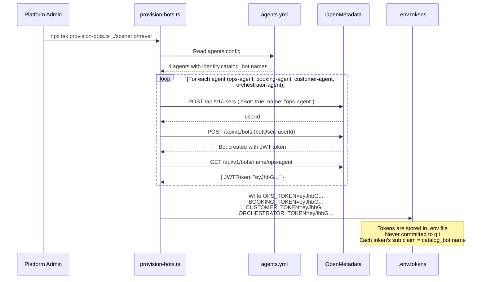
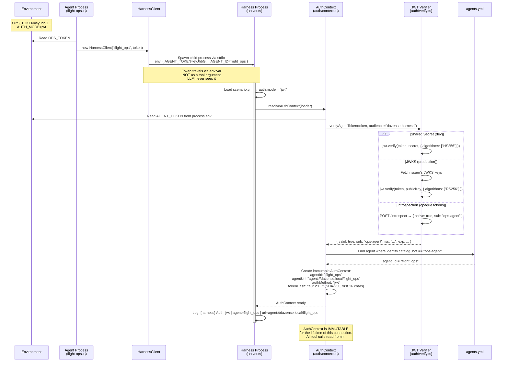
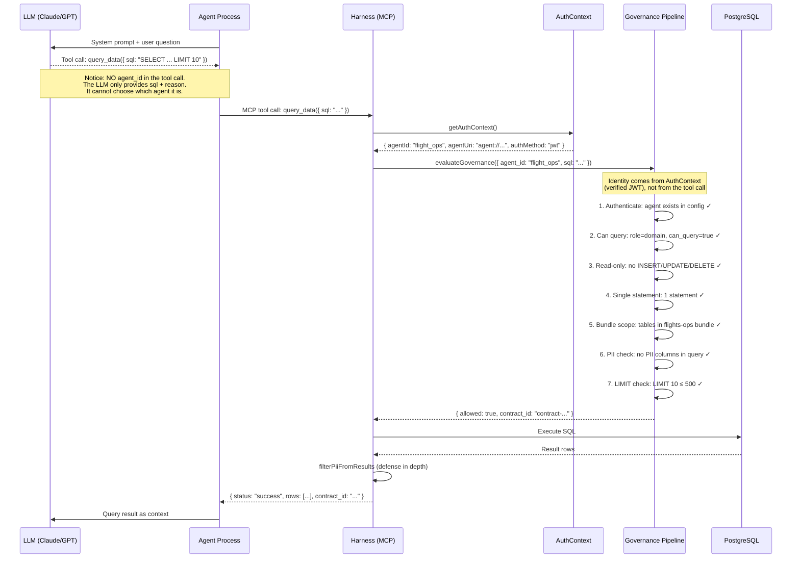
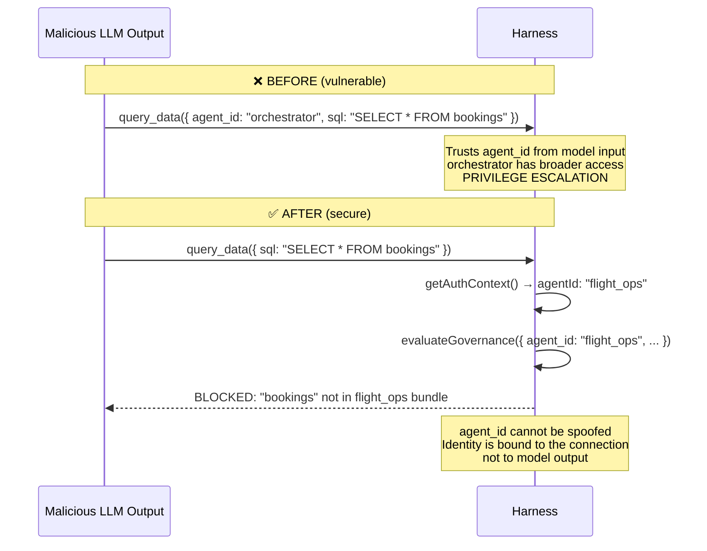
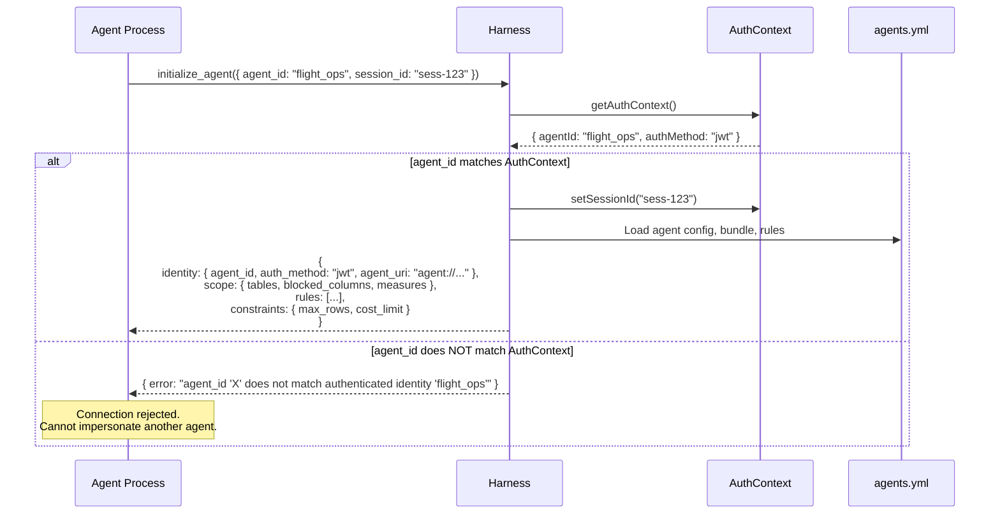
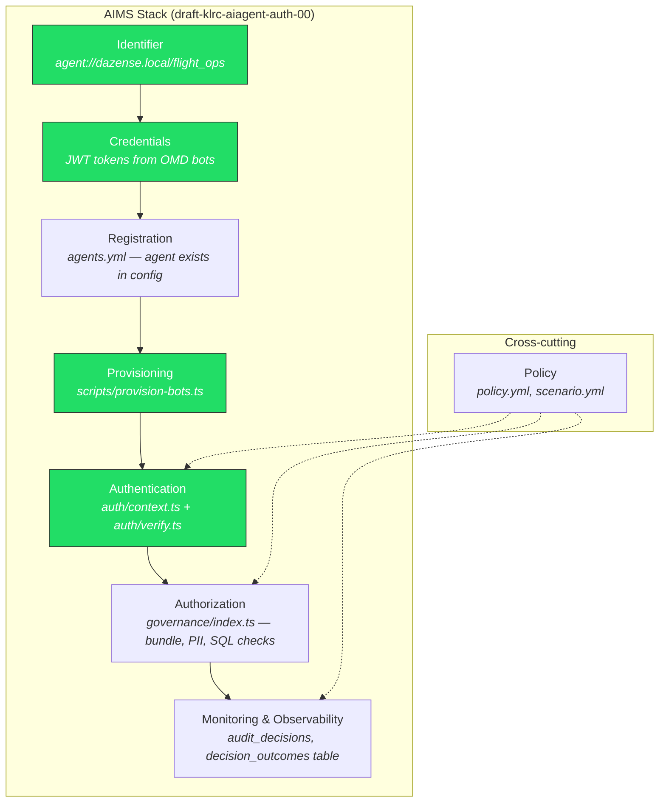
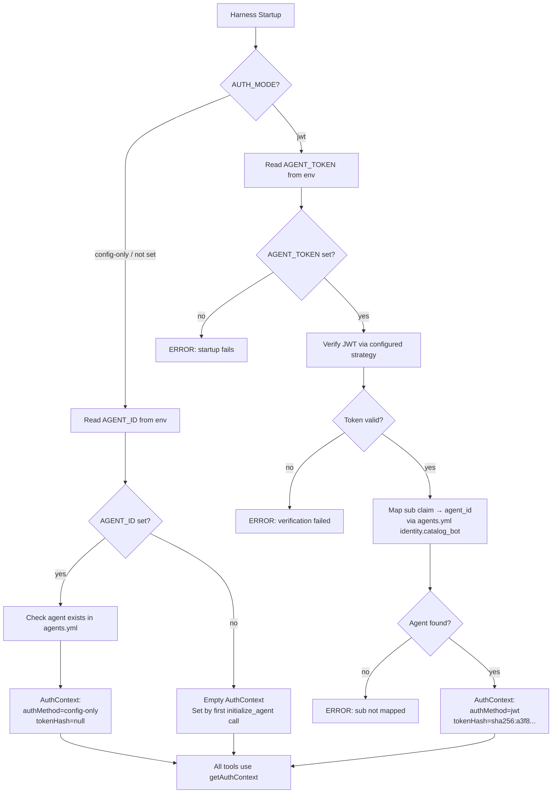

# Agent Authentication & Identity — Sequence Diagrams

Grounded in [draft-klrc-aiagent-auth-00](https://datatracker.ietf.org/doc/html/draft-klrc-aiagent-auth-00) (IETF AI Agent Auth, March 2026).

---

## 1. Credential Provisioning (one-time setup)

How agents get their identity and credentials before any runtime interaction.

---

## 2. Agent Startup & Authentication (every connection)

How identity flows from env var through the connection to the harness — the token never reaches the LLM.

---

## 3. Tool Call — Identity Enforcement (every query)

How `agent_id` is resolved from AuthContext, not from model output. The LLM cannot spoof identity.

---

## 4. Identity Spoofing Prevention — Before vs After

---

## 5. initialize_agent — Validation Flow

---

## 6. Full AIMS Stack — How It Maps to the Codebase

Green = implemented in this PR

---

## 7. Config-Only vs JWT Mode

