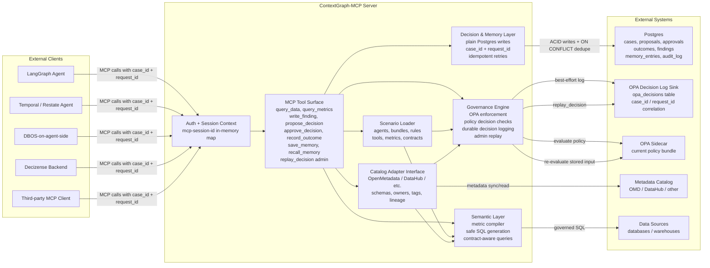

# ContextGraph-MCP Architecture

ContextGraph-MCP has no embedded DBOS or workflow engine. Workflow durability lives in the client agent runtime; the MCP server stays stateless for workflow orchestration and uses Postgres for durable business, audit, memory, and OPA decision records.
