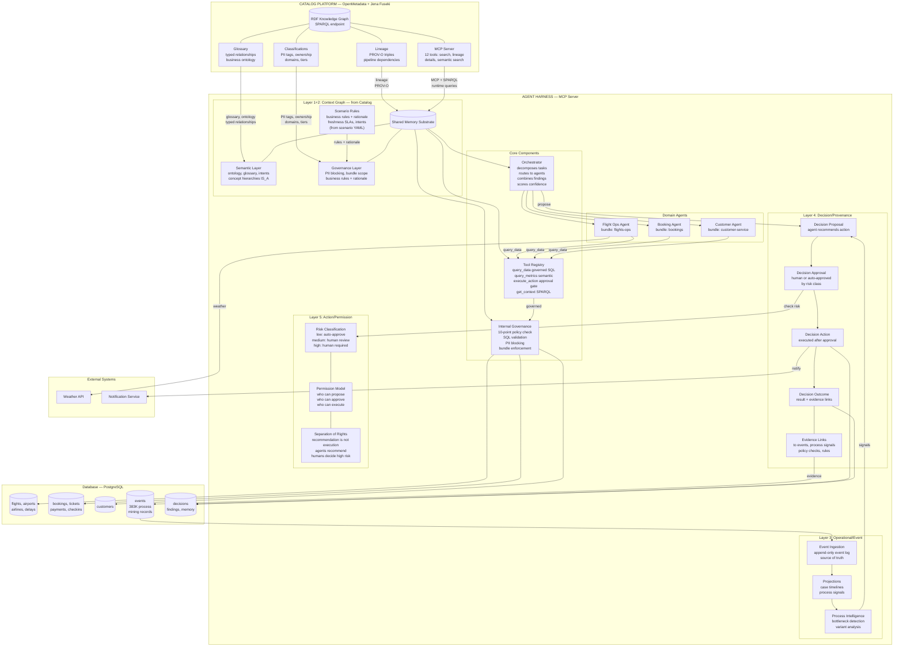

# Agent Harness Architecture (v2)

## Overview

The harness is an MCP server that sits between AI agents and enterprise data/systems. It provides governed context, enforces policies, manages decisions, and controls actions — across 5 canonical layers.

## Invariants

- Meaning before action
- Policy before execution
- Traceability by default
- Replayability required
- Human-gated autonomy progression

## Architecture Diagram



## The 5 Canonical Layers

### Layer 1+2: Context Graph (from Catalog)

**Source**: OpenMetadata + Jena Fuseki RDF store

The catalog platform is the source of truth for meaning and governance metadata. The harness reads from it via:

- **MCP Server** (12 tools) — search, lineage, entity details, semantic search
- **SPARQL endpoint** — complex graph queries
- **REST API** — simple lookups

**Design principle: maximize what comes from OMD, minimize what stays in YAML.**

What comes from the catalog (OMD):

| Capability      | OMD feature                                 | RDF standard                             |
| --------------- | ------------------------------------------- | ---------------------------------------- |
| Entity types    | Tables, columns, dashboards, pipelines      | `om:Table`, `om:Column` classes          |
| Lineage         | Pipeline dependencies, column-level lineage | `prov:wasDerivedFrom` (PROV-O)           |
| Glossary        | Business terms with typed relationships     | Custom RDF predicates with cardinality   |
| Classifications | PII, Sensitive, Tier tags                   | `om:classification` properties           |
| Ownership       | Teams, domains, certification               | `om:owner`, `om:domain`                  |
| Validation      | Schema constraints                          | SHACL shapes (`openmetadata-shapes.ttl`) |
| Bundles         | Domains + Data Products → trust boundaries  | Domain containment, Data Product ports   |
| Freshness SLAs  | Data quality tests + profiler freshness     | Quality test thresholds, last_modified   |

What stays in scenario YAML (OMD cannot express these):

| Capability        | Why YAML                                                                     |
| ----------------- | ---------------------------------------------------------------------------- |
| Business rules    | Enforcement logic with severity/guidance/rationale — OMD has no rules engine |
| Intent mappings   | "This question maps to these measures" — harness-specific concept            |
| Agent definitions | Agent identity, role, system prompt — runtime config                         |
| Inter-agent rules | Data sharing rules, cost limits — harness-specific                           |

### Layer 3: Operational/Event

**Source**: PostgreSQL events table

The event log is the append-only source of truth for what happened. Each booking is a process instance (`case_id = booking_id`).

```
Event Ingestion (append-only)
    → Projections (case timelines per booking)
    → Process Intelligence (bottlenecks, variants, signals)
```

Event types in travel scenario:

```
CustomerRegistered → FlightSearched → FlightSelected → BookingCreated
→ PaymentSucceeded/PaymentFailed → TicketIssued → CheckInCompleted
→ BoardingStarted → FlightDeparted → FlightArrived
→ FlightDelayed → FlightCancelled → RebookingInitiated → CompensationIssued
```

Process intelligence outputs become **signals** that feed decision proposals:

- "87% of delays at CDG on Fridays exceed 45 minutes"
- "Payments via wallet have 3x higher failure rate"
- "Average time from BookingCreated to CheckInCompleted: 12 days"

### Layer 4: Decision/Provenance

**Source**: PostgreSQL (decision_proposals, decision_approvals, decision_actions, decision_outcomes, decision_findings, agent_memory)

Every significant agent action follows a lifecycle with evidence links:

```
propose_decision
    agent_id: "flight_ops"
    proposed_action: "connection safe, no rebooking needed"
    evidence_event_ids: [766218]           ← links to Layer 3 events
    evidence_signal_types: ["delay_patterns"] ← links to process signals
    evidence_rules: ["checkin_window"]     ← links to Layer 2 rules
    risk_class: "low"
    confidence: HIGH
        ↓
approve_decision
    approved_by: "auto" (low risk) or "human:operator_jane" (high risk)
    approved: true
        ↓
execute_decision_action
    action_type: "notify_customer"
    parameters: { customer_id: "C101", message: "connection safe" }
    status: "completed"
        ↓
record_outcome
    decision_summary: "Connection safe. Customer notified."
    evidence_event_ids: [766218]           ← traceable back to triggering event
    evidence_rules: ["checkin_window"]     ← traceable to governance rules
    evidence_proposal_ids: [1]             ← traceable to the proposal
    → stored as searchable precedent (search_precedent tool)
```

Supporting tools:

- `write_finding` / `read_findings`: shared workspace for multi-agent collaboration
- `save_memory` / `recall_memory`: cross-session agent learnings

### Layer 5: Action/Permission

**Source**: Scenario configuration (agents.yml + policy.yml)

| Risk class | Examples                                               | Approval                 |
| ---------- | ------------------------------------------------------ | ------------------------ |
| Low        | Read data, generate report, send info notification     | Auto-approved            |
| Medium     | Flag for review, send warning notification             | Human review optional    |
| High       | Rebook passenger, issue compensation (< EUR 400)       | Human approval required  |
| Critical   | Cancel flight, override policy, compensation > EUR 400 | Senior approval required |

Permission model:

- **Propose**: which agents can recommend actions (all domain agents)
- **Approve**: who can approve by risk class (auto for low, human for high)
- **Execute**: who can trigger the actual action (harness, after approval)

Progressive autonomy:

- Start: human approves everything
- After 50 successful low-risk decisions: auto-approve low risk
- After 200 decisions with < 2% error: auto-approve medium risk
- High/critical: always human

## MCP Tools by Layer (29 tools total, all real except query_metrics)

| Layer        | Tools                                                                                                                                 | Status                                                                                                     |
| ------------ | ------------------------------------------------------------------------------------------------------------------------------------- | ---------------------------------------------------------------------------------------------------------- |
| 1+2 Context  | get_context, get_entity_details, get_lineage, search_glossary, search_precedent, get_rationale                                        | **Real** — catalog for entities/glossary/lineage, YAML for rationale.                                      |
| 2 Governance | initialize_agent, get_business_rules + internal pipeline (auth, bundle, PII, joins, SQL, execution flags)                             | **Real** — PII from catalog, bundles + rules from YAML. Parameterized queries.                             |
| 3 Event      | ingest_event, get_case_timeline, get_process_signals                                                                                  | **Real** — PostgreSQL events table (383K records). 4 signal types.                                         |
| 4 Decision   | propose_decision, approve_decision, execute_decision_action, record_outcome, write_finding, read_findings, save_memory, recall_memory | **Real** — full lifecycle with evidence links. Permission-enforced approve/execute.                        |
| 5 Action     | query_data, query_metrics, execute_action, get_permissions                                                                            | **Real** (query_metrics scaffold). Risk classification, permissions, approval gates, progressive autonomy. |
| Admin        | find_governance_gaps, simulate_removal, graph_stats, audit_decisions                                                                  | **Real** — catalog + YAML cross-checks, lineage impact, decision audit.                                    |
| Verify       | verify_result, check_freshness, check_consistency, get_confidence                                                                     | **Real** — rule compliance, SLA freshness, composite confidence scoring.                                   |

### Security

- All SQL queries use parameterized placeholders ($1, $2, etc.)
- PII blocked at SQL text level AND result schema level (SELECT \* on PII tables blocked)
- Approval/execute permission enforcement checks agent role against risk class
- Defense-in-depth: all query results filtered through PII column list from catalog

## Proving Workflow: Missed Connection Rebooking

Forces all 5 layers to interact:

1. **Event** (layer 3): `FlightDelayed` event for F1001 (45 min delay)
2. **Context** (layer 1+2): Harness queries OMD — flight schedule, booking, customer loyalty tier
3. **Process signal** (layer 3): "Connection buffer: 2h45m, minimum: 60min, 94% similar cases resolved without rebooking"
4. **Governance** (layer 2): Rules — checkin_window (45 min), rebooking_priority (connections first), EU-261 compensation threshold (3h)
5. **Decision proposal** (layer 4): Ops agent proposes "connection safe, no rebooking needed" with evidence
6. **Risk classification** (layer 5): Low risk (informational, no financial action)
7. **Auto-approved** (layer 5): Low risk → logged with evidence chain
8. **Action** (layer 5): Notify customer + lounge voucher (Gold tier exception)
9. **Outcome** (layer 4): Decision stored as precedent, evidence links to event, rules, and process signals

## Technology Stack

| Component          | Technology               | Purpose                                    |
| ------------------ | ------------------------ | ------------------------------------------ |
| Harness MCP server | TypeScript (MCP SDK)     | Core runtime                               |
| Catalog platform   | OpenMetadata 1.12        | Knowledge graph, glossary, lineage         |
| RDF store          | Apache Jena Fuseki       | SPARQL queries, semantic reasoning         |
| Database           | PostgreSQL 16            | Scenario data + events + decisions         |
| UI                 | React (dazense frontend) | Chat interface                             |
| Backend            | Fastify + tRPC           | UI shell, MCP bridge                       |
| Agent framework    | Any (via MCP)            | Pluggable — Claude, GPT, LangChain, CrewAI |
